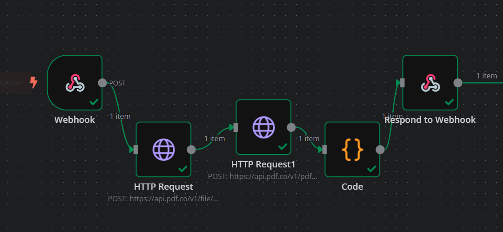
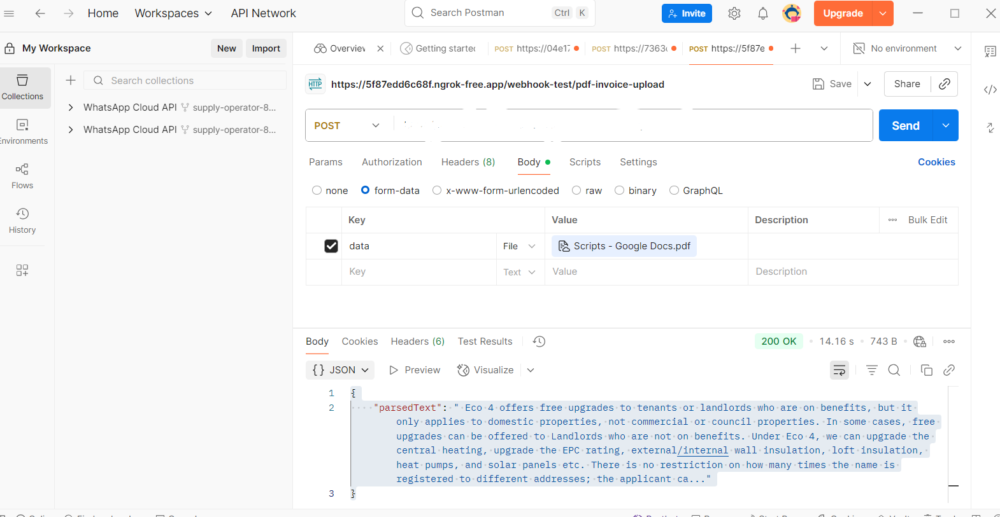

# 📄 n8n PDF Text Extractor Using PDF.co

This repository contains an **n8n** workflow that allows you to upload a PDF via a webhook endpoint, send it to **PDF.co** for processing, and return the extracted and cleaned text ("crust") in real time.

---

## 🚀 Features
- Receive PDF files directly through an n8n **Webhook** node
- Upload PDF to PDF.co temporary storage
- Convert PDF to text using PDF.co's `pdf/convert/to/text` endpoint
- Clean and format extracted text (remove extra spaces, new lines)
- Return processed text instantly in the webhook response

---

## 🛠 Requirements
- [n8n](https://n8n.io) (Self-hosted or Cloud)
- [PDF.co API Key](https://pdf.co) (Sign up for one)
- Postman or any tool to send HTTP POST requests

---

## 📂 Workflow Overview
```plaintext
Webhook (receive PDF)  
  ↓  
HTTP Request #1 (upload PDF to PDF.co → get temp URL)  
  ↓  
HTTP Request #2 (convert PDF to text)  
  ↓  
Function (clean & prepare extracted text)  
  ↓  
Webhook Response (send back "crust")
```

---

## ⚙️ Setup Instructions
1. **Clone this repository**
   ```bash
   git clone https://github.com/yourusername/n8n-pdf-text-extractor.git
   cd n8n-pdf-text-extractor
   ```
2. **Import the workflow JSON**
   - Open n8n → Click *Import from File* → Select `workflow.json` from this repo.
3. **Add PDF.co API Key**
   - In both HTTP Request nodes:
     - Go to *Headers*
     - Set `x-api-key` to your PDF.co API Key
4. **Activate the workflow**
   - Toggle the workflow to *Active* in n8n.
   - Use the *Production* webhook URL (e.g., `http://localhost:5678/webhook/pdf-invoice-upload`).
5. **Test with Postman**
   - **Method**: POST
   - **URL**: Your webhook URL
   - **Body**: form-data
     - **Key**: `file` (Type: File)
     - **Value**: Select a PDF from your computer

---

## 📤 Example Request (Postman)
**Body (form-data)**:
```
Key: file
Type: File
Value: example.pdf
```

---

## 📥 Example Response
```json
{
  "parsedText": "Eco 4 offers free upgrades to tenants or landlords..."
}
```

---

## 📸 Screenshots
| Workflow in n8n | Webhook Response |
|-----------------|------------------|
|  |  |

---

## 📚 Notes
- The PDF.co file upload endpoint requires the form field name to be exactly `file`.
- The workflow is designed for *Production* mode — ensure it's active before sending requests.
- The extracted text is cleaned for extra spaces and line breaks in the Function node.

---

## 🌐 Connect With Me
- LinkedIn: [Ahmad Raza](https://www.linkedin.com/in/ahmad-raza-403bbd0278)
- Fiverr: [nitrola](https://www.fiverr.com/nitrola)

---

## 📄 License
This project is licensed under the MIT License.

---
